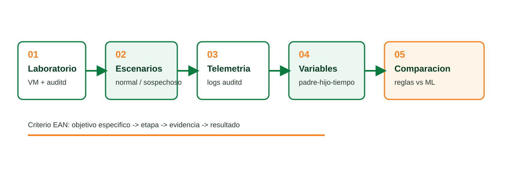
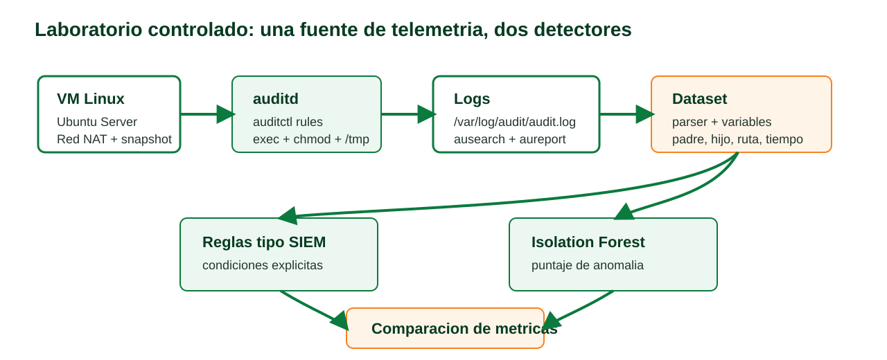

# Comparacion entre reglas tipo SIEM e Isolation Forest

## Cadenas de procesos sospechosas en endpoints Linux instrumentados con auditd

Daniel Esteban Lopez Suarez  
Ingenieria de Sistemas - Universidad EAN  
Primera sustentacion

<!--
Oral: Presenta el proyecto como una comparacion experimental, no como una promesa de que ML siempre gana.
-->

---

# Contexto: el ruido operativo en un SOC

- Analistas **L1, L2 y L3**
- Alertas desde **SIEM / EDR / telemetria**
- Muchos eventos son **falsos positivos**
- El problema: distinguir **secuencia legitima** vs **secuencia sospechosa**

**Idea clave**  
No falta telemetria: falta contexto para decidir si una cadena de procesos merece respuesta.

<!--
Oral: Arranca con el caso realista del SOC. Cada falso positivo consume tiempo y puede activar una respuesta innecesaria.
-->

---

# Pregunta y objetivos

**Pregunta:** ¿que diferencias de desempeño existen entre reglas tipo SIEM y un detector de anomalías con ML para identificar relaciones padre-hijo inusuales y descarga seguida de ejecucion?

<strong>Laboratorio</strong> VM Linux + auditd

<strong>Escenarios</strong> normal y sospechoso

<strong>Evaluacion</strong> deteccion, falsos positivos y tiempo

<!--
Oral: Enfatiza que el objetivo general es comparar ambos enfoques bajo las mismas condiciones y con metricas homogeneas.
-->

---

# Estado del arte sintetizado

| Enfoque | Aporte | Limitacion |
|---|---|---|
| Reglas / SIEM | Explicabilidad y control | Rigidez ante variaciones |
| Anomalías / ML | Detecta desviaciones | Riesgo de falsos positivos |
| Logs modernos | Secuencias y grafos | Dependen de buena representacion |

**Brecha:** comparacion directa sobre procesos Linux con auditd en laboratorio local.

<!--
Oral: Menciona que la literatura reciente resalta la importancia de representar bien los registros, no solo elegir un modelo potente.
-->

---

# Metodologia experimental

<!--
Oral: Recorre las cinco etapas y conecta cada una con evidencia: VM, escenarios, logs, variables y comparacion.
-->

---

# Arquitectura del laboratorio

<!--
Oral: Explica que auditd no es el detector; es la fuente de telemetria. La deteccion ocurre despues, con reglas y con Isolation Forest.
-->

---

# Avance tecnico: evidencia a mostrar

<strong>1</strong> VM Linux creada

<strong>2</strong> auditd activo

<strong>3</strong> reglas auditctl

<strong>4</strong> escenarios seguros

<strong>5</strong> logs ausearch

<strong>6</strong> dataset inicial

**Nota:** las metricas finales quedan pendientes hasta completar repeticiones.

<!--
Oral: No vendas resultados. Vende trazabilidad: escenario ejecutado, log capturado, variable construida.
-->

---

# Metricas de evaluacion

| Metrica | Que responde |
|---|---|
| Recall / tasa de deteccion | ¿cuanto de lo sospechoso detecta? |
| Tasa de falsos positivos | ¿cuanto ruido produce? |
| Precision | ¿que tan confiable es la alerta? |
| F1 score | ¿como equilibra precision y recall? |
| Tiempo de deteccion | ¿que tan rapido alerta? |

<!--
Oral: Relaciona las metricas con la operacion del SOC: detectar mas no sirve si el ruido vuelve inmanejable la respuesta.
-->

---

# Resultados esperados y aporte

**Reglas tipo SIEM**

- Interpretables
- Buenas para patrones definidos
- Requieren mantenimiento

**Isolation Forest**

- Aprende linea base
- Puede detectar desviaciones
- Requiere calibrar falsos positivos

Aporte: reducir ruido operativo y apoyar decisiones de monitoreo en Linux con evidencia reproducible.

<!--
Oral: La contribucion es comparativa y practica. No declares ganador antes de medir.
-->

---

# Cierre y proximos pasos

1. Completar repeticiones por escenario.
2. Consolidar dataset auditd.
3. Calcular matriz de confusion y tiempos.
4. Ajustar reglas y umbral del modelo.
5. Preparar sustentacion final con resultados validados.

**Mensaje final:** problema delimitado, metodologia coherente y prototipo reproducible.

<!--
Oral: Cierra con seguridad: la primera sustentacion prueba claridad, avance y ruta tecnica defendible.
-->
